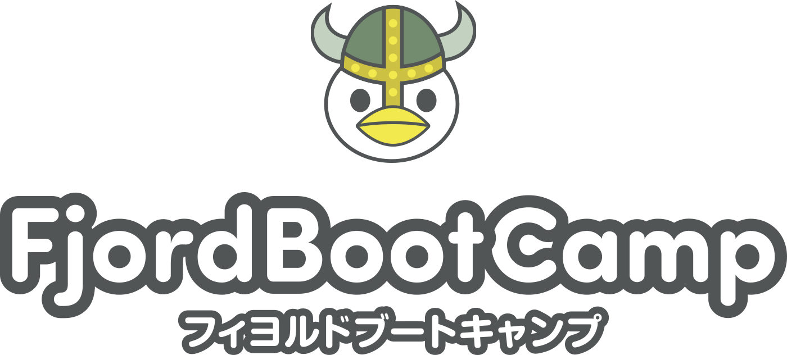

<!-- _class: lead -->

# プログラミングスクールでのOSS教育

駒形真幸@株式会社フィヨルド

---
## FBCの紹介

- 弊社の運営しているプログラミングスクール　フィヨルドブートキャンプがどんなものなのか。
- FBCがOSSコミュニティーとどのような関わりをしてきたのか。
  - OSSコミュニティ・イベントへの参加の推奨
  - 登壇を後押しするための「初めてのLT会」の定期開催
  - 輪読会やミートアップ開催への後押し。
  - RubyKaigiへの参加補助
    - 宿泊施設「フィヨブーハウス」
  - RubyKaigiへ卒業生が複数登壇
---
## OSS教育

- OSS教育を取り入れています。
- OSSとは何なのか。歴史の勉強。
- OSS Gateとコラボしたコントリビュート体験会
  - 本物のOSSプログラマーから楽しさを学ぶ
- プログラミングスクールになぜOSS教育が必要なのか
  - 今の環境はプログラマーが勝ち取ってきたもの
  - OSSは世界で戦っている高いレベルなのでそれに合わせる。
  - OSS活動はプログラミングの一番楽しいエンドコンテンツ
    - 楽しい＝続く・上達する
