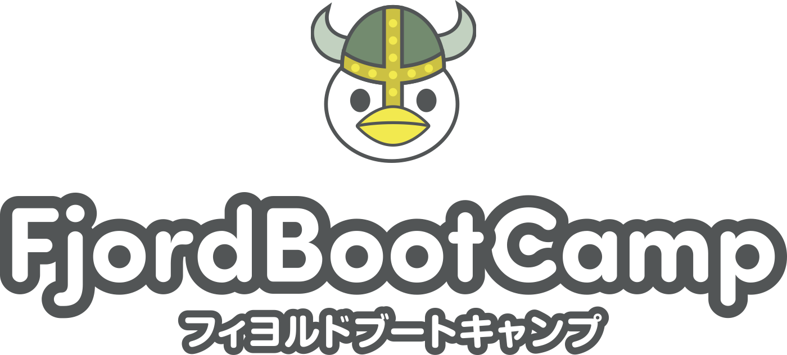
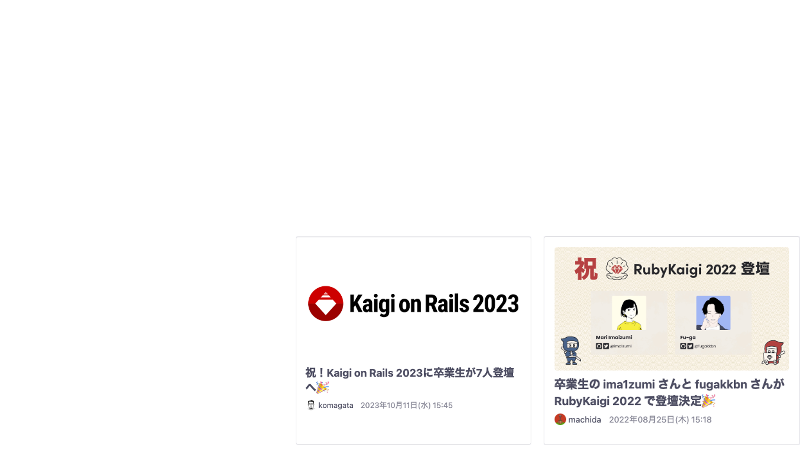
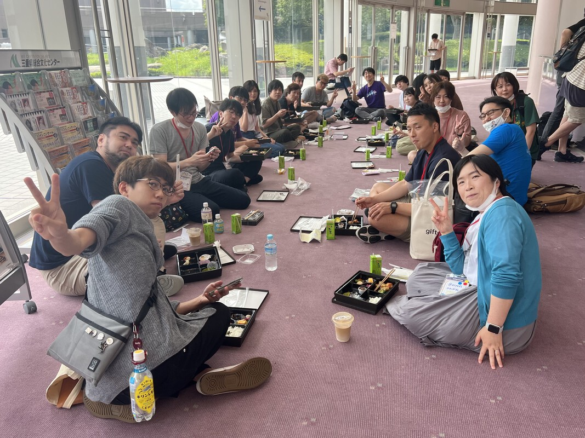
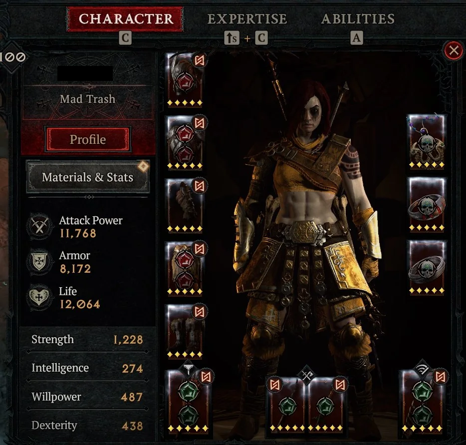
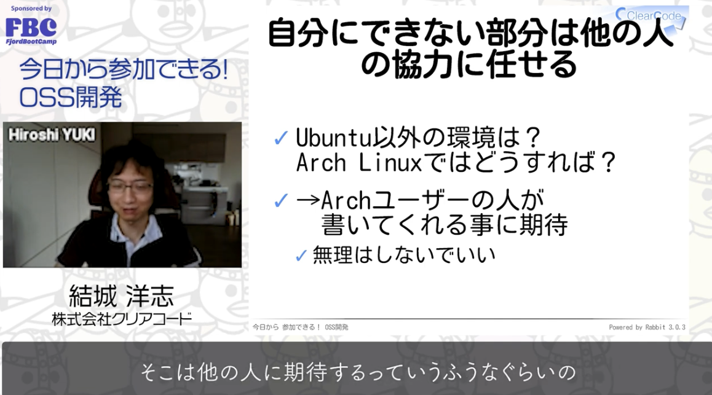
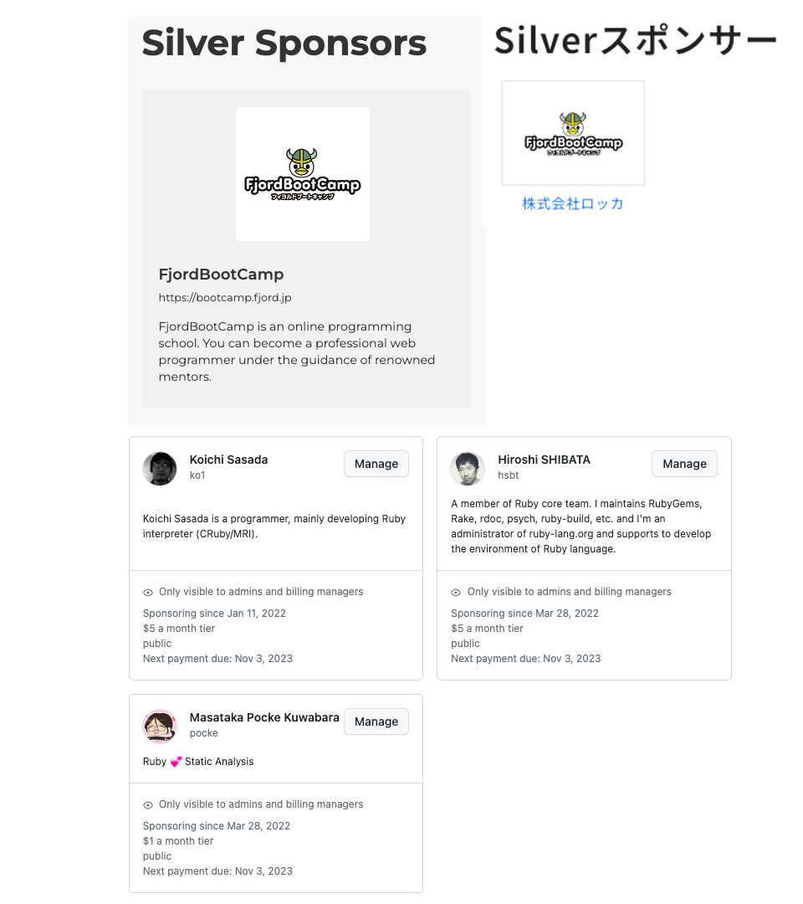
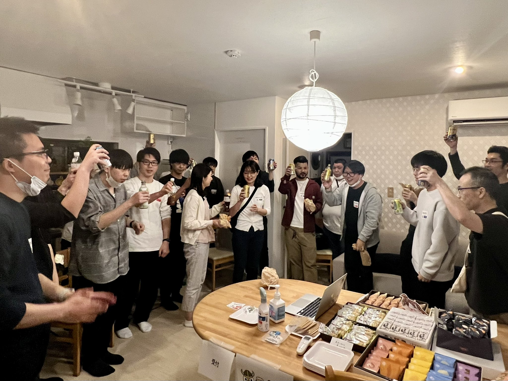
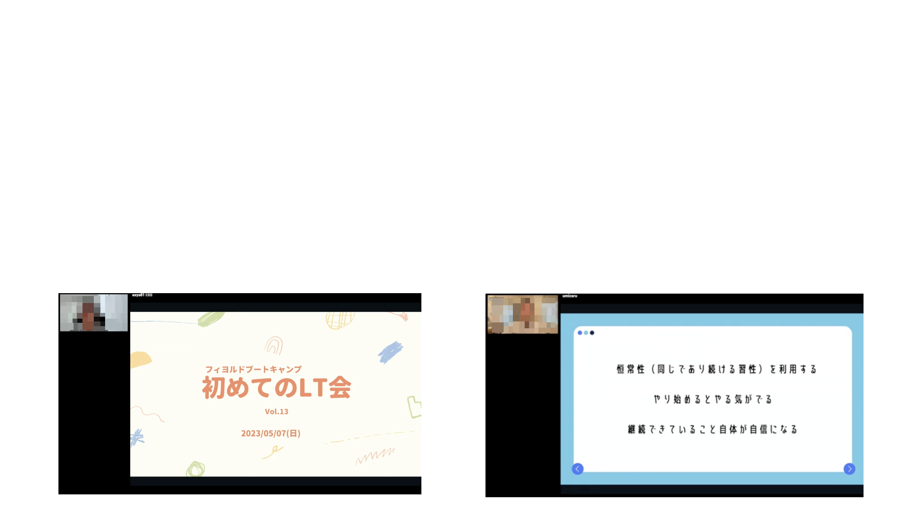

<!-- _class: lead -->

# プログラミングスクールでのOSS教育

駒形真幸@株式会社ロッカ

---
<!-- _class: lead -->

## @komagata
フィヨルドブートキャンプ（FBC）代表・メンターです。

<!--
駒形と申します。
フィヨルドブートキャンプでは代表兼、スクールでのメンターをやっています。
25年ぐらいプログラマーをやっていて、ここ数年はプログラミングスクールを運営しています。
-->

---
## 目次

1. FBCの紹介
1. なぜOSS教育なのか
1. OSS教育の内容

<!--
今日は大まかに、フィヨルドブートキャンプの紹介と、なぜOSS教育なのか、OSS教育の実際の内容についてお話し致します。
-->

---
<!-- _class: lead -->
# FBCの紹介

<!--
プログラミングスクールのフィヨルドブートキャンプの紹介をします。
-->

---
## FBCの紹介

特徴に絞って紹介します。

1. サブスク形式
1. カリキュラムがハード
1. メンターがプロだけ
1. OSS教育🆕

<!--
簡単に特徴に絞って紹介します。
-->

---
## 1. サブスク形式

1ヶ月毎のサブスク形式なのですぐ辞めればお金が殆どかからない。

みんながプログラマーに向いてるわけじゃないので向いてないことがわかればOK。

<!--
一つ目はサブスク形式ということです。
一ヶ月毎に課金されるサブスク形式なので、最初に大金を支払う必要はなくて、一ヶ月で辞めれば一ヶ月分だけのお金で済みます。

みんながみんな必ずプログラマーにならなきゃいけないわけではないですし、専門職はそういうものではないと思います。
向いていないことがわかればわかったでそれは他のことをやれば良いので、前進だと思っていますし、そのように説明しています。
-->

---
## 2. カリキュラムがハード

平均1200時間かかる。

期間は人それぞれだが、半年〜一年半かかる。

例：
Linux、Git & GitHub、Ruby、HTTP、Nginx、データベース、オブジェクト指向プログラミング(Ruby)、Rails、自動テスト、JavaScript、React、Webセキュリティ、システム開発、Webサービス開発

<!--
二つ目はカリキュラムがハードということです。
卒業するまでに平均で学習時間が1200時間ほどかかります。
期間については平日夜中だけやる人もいれば、フルタイムでやる人もいるので人それぞれですが、
半年から一年半ぐらいかかります。

内容としては、RailsプログラマーコースではLinuxの使い方やNginxでWebサーバーを建てるところからやって、RubyやRails、自動テストやJavaScript、Reactなんかを学びます。
またスクラム形式で実際にこのスクールで使っているEラーニングシステム自体を開発したり、アイデアの部分からWebサービスを自分で作ってデプロイするカリキュラムもあります。
-->

---
## 3. メンターがプロだけ

メンターはプロのエンジニアのみ。

卒業生がアルバイトでといったのは無し。

<!--
メンターがプロのエンジニアだけというのも特徴です。
プロのエンジニアが副業でメンターをやってださっています。
コードレビューなど、決まりきった答えではないカリキュラムがたくさんあるので、
プロではないと答えられないと思っています。
また、エンジニアのコミュニティを重視しているので、メンターはプロだけにしています。
よくある卒業生がアルバイトでメンターをやるといったことはなしにしています。
-->

---
## 4. OSS教育🆕

後ほど紹介します。

<!--
こちらは後ほどお話しします。
-->

---
<!-- _class: lead -->
# なぜOSS教育なのか

<!--
次はなぜOSS教育なのかについてお話しします。
-->

---
## なぜOSS教育なのか

プログラミングスクールではOSS教育をした方が良い。

ソフトウェア開発をする企業もした方が良い。

<!--
プログラミングスクールではOSS教育をした方が良い。
と思っています。
そして
ソフトウェア開発をする企業も同じくした方が良い。
と思っています。
-->

---
## OSS知識の現状

職業プログラマーでも、

「Rubyって（企業でなく）一般の人が作ってたんですね」

「gemって中身見ちゃっていいんですね」

「GPLって何ですか？」

という新人はいる。

弊社スクールでも興味を持った人に個別に説明したり、OSS活動を促したりする状態だった。

---
## なぜOSS教育なのか
　
- 技術力が上がる
- モチベーションが上がる

---

## 世界で戦う

OSSは世界中で競っているコミュニティ。

井の中の蛙を防げる。

<!--
技術力が上がる点についてですが、

OSSというのは世界中で競っているコミュニティなので、
会社内や周辺コミュニティだけの井の中の蛙状態を防げます。
-->

---
## うちの天才プログラマー問題

「うち（弊社）に天才プログラマーがいるんで」

その会社でしか通用しない人、社外から見たら「はぁ？」ってことがよくある。

<!--
「うちの天才プログラマー問題」というのがあります。
営業さんとかが外部にに「うちにに天才プログラマーがいるんで大丈夫です」
とかよく言ってて、
狭い会社内だけのコミュニティだと勘違いしちゃいがちです。
社外から見たら「はぁ？どこが？」ってことはよくあります。

OSS活動していればそれを防げるわけです。
-->

---
## 世界で共通の作法が学べる

- GitHubなどのツールの使い方。
- 議論の仕方。合意の取り方。
- コミュニケーションの仕方。

---
## 汎用的なソフトウェアの作り方が学べる

- 特定のOSに依存しない作り方。
- 特定のソフトウェアバージョンに依存しない作り方。
- 長く動き続けるソフトウェアの作り方。

---
## メンター・先輩の能力が限界を決める問題

弊社スクールでの優秀な卒業生はみんなOSS活動をやっている。

OSS活動を通じて優秀な人はメンターを抜いていく。
（メンターの実力が生徒のMAX技術力を決めてはいけない）

<!--
技術力については弊社スクールで考えてみても、
優秀な卒業生はみんなOSS活動をやっているなと思います。
-->

---
## モチベーションが上がる

プログラミング学習で一番の難点は長く続けられるモチベーション維持。

プログラミングが楽しくなれば続けられるようになり、教育の９割は完了。

<!--
モチベーションについてですが、

スクールを何年もやっていて本当に感じるのが、
長く続けるモチベーション維持が一番難しいし、大事だということです。

スクールとして技術的な内容のカリキュラムがだんだん整備されていくんですが、
効率的に技術を覚える方向になってしまって楽しさについて忘れがちです。

生徒の方を見ていても、プログラミングが楽しくなったらあとは勝手に勉強していくんで、
いかにプログラミングを楽しく思ってもらえるかだと思います。
-->

---
<!-- _class: photo -->
## 楽しいプログラミングとは

楽しいプログラミング ＝ OSS活動

（異論は認める）

---
<!-- _class: photo -->
## GitHubは最高のSNS

インスタなんて目じゃない。

---
## エンドコンテンツ

OSS活動はプログラマーのエンドコンテンツ。

終わりのない技術の研鑽活動でもある。

---
## 社会的意義

フリーソフトウェア・OSSの歴史を学べば社会的意義がわかる。

OSSは当たり前ではなく、先人が戦って勝ち取ってきた権利。
（最近この辺の認識は怪しい😭）

自分の心地よい開発環境を守る活動でもある。

やり甲斐・モチベーションにつながる。

---
## OSS教育があるべき

全員がOSSの意義を知り、OSSへのコントリビュート方法を知り、コントリビュートをしたことあるという状態だったらすごく良さそう。

優秀なプログラマーがたくさん生まれそう。

---
<!-- _class: lead -->
# OSS教育の内容

試行錯誤中ではありますが。

---
## OSS知識

- フリーソフトウェア・OSSの意義と歴史を学ぶ
- OSSの定義を学ぶ

---
## OSSへのコントリビューション支援

OSS GateとコラボさせてもらってOSSに初めてコントリビュートするハンズオンイベントを開催。

OSSへのコントリビューションは特別なことではない、誰にでもいろんな貢献方法があることを学び、
実際に自分が使っているソフトウェアへIssueやPRを作る。

---
## OSSコミュニティ活動支援

- コミュニティ支援
- イベント参加支援
- イベント登壇支援

---
## コミュニティ支援

各種OSSコミュニティへのスポンサーシップ

- RubyKaigi
- RubyWorld Conference（🎉）
- Kaigi on Rails
- RailsGirls
- 各種個人へのGitHub Sponsors

---
## イベント参加支援

参加して当然の空気を出す。

「RubyKaigi参加しないの？何か用事があるの？」

---
<!-- _class: photo -->
## イベント参加支援

RubyKaigiではフィヨブーハウスを開催。

一軒家を借りて宿泊費を負担。一人での参加の敷居を下げる。

<!--
（フィヨブーハウスは男性のみ。）
（女性は同様の試みのエモリハウスでの宿泊費を負担。）
-->

---
## イベント登壇支援

初めてのLT会開催（現在まで13回開催）

初めてLTをする人のための会。絶対に批判されない優しい会。

---
## まだまだこれから

OSS教育はまだ始まったばかりですが、OSSにコントリビュートする人が増えたり、イベントで登壇する人が増えてきています。

---
<!-- _class: lead -->
## まとめ

スクールでも企業でもOSS教育をしよう！

---
## 最後に宣伝

弊社では企業研修もやってます。

ご清聴ありがとうございました。

