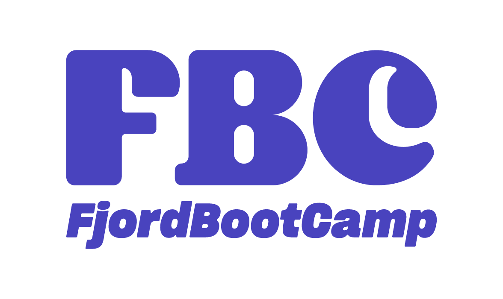
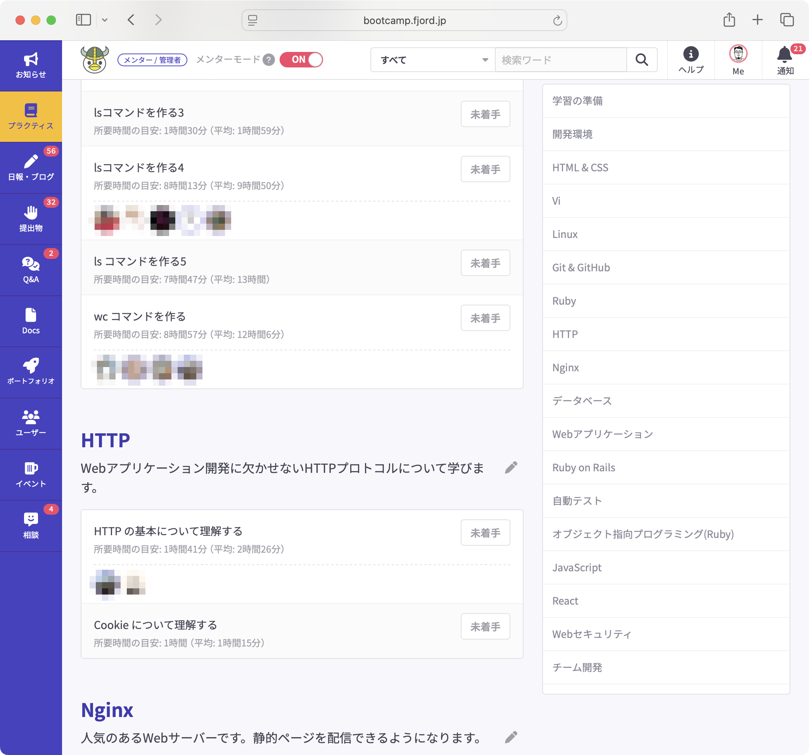
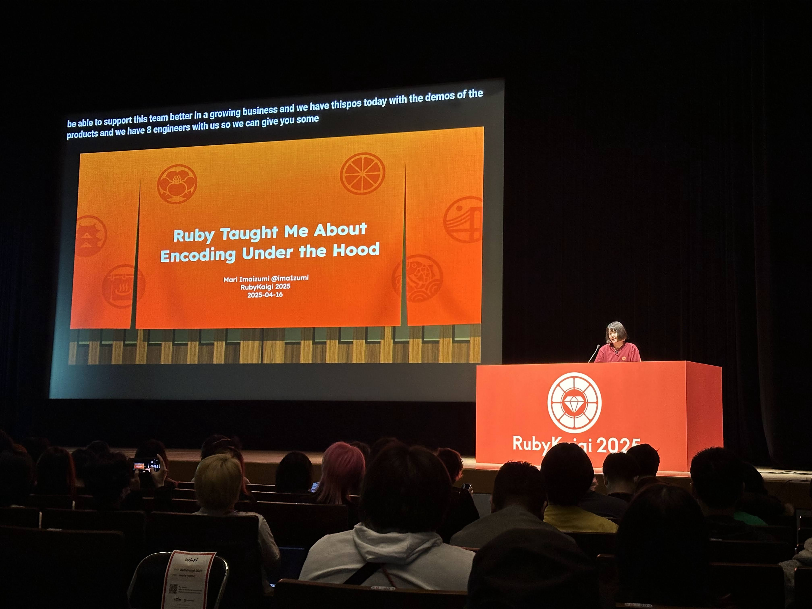
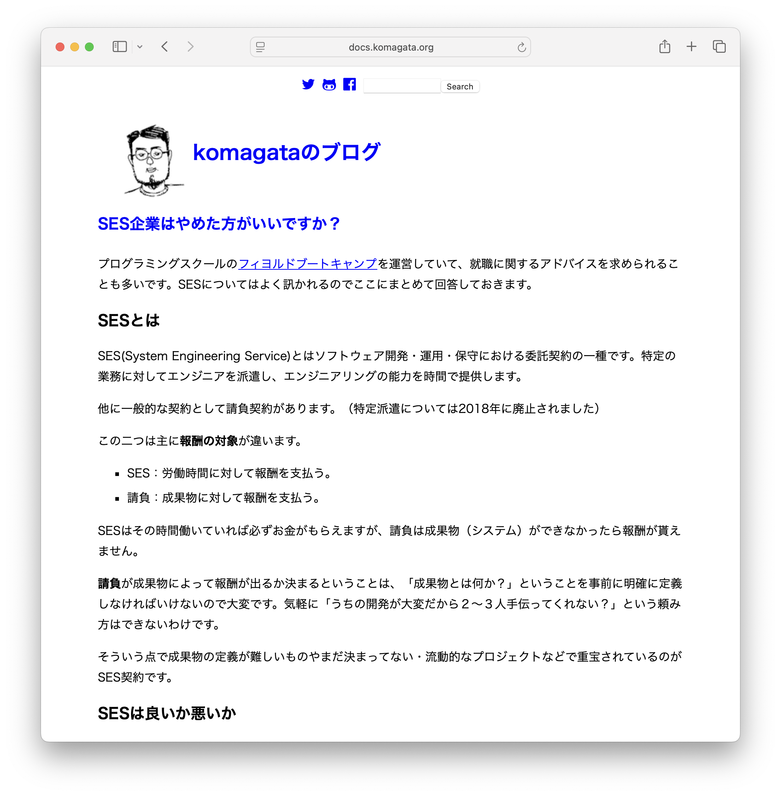
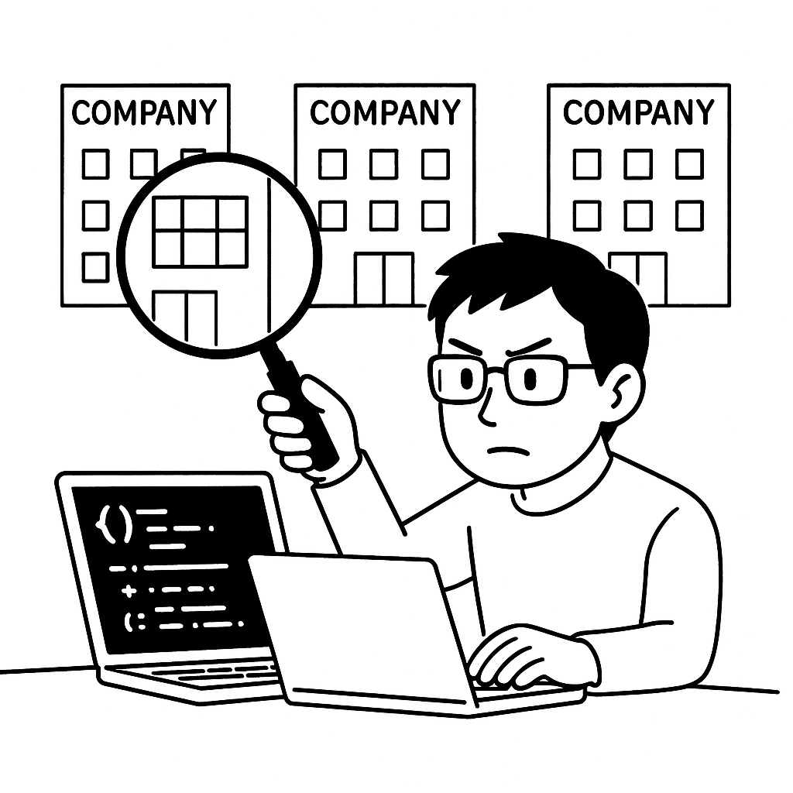
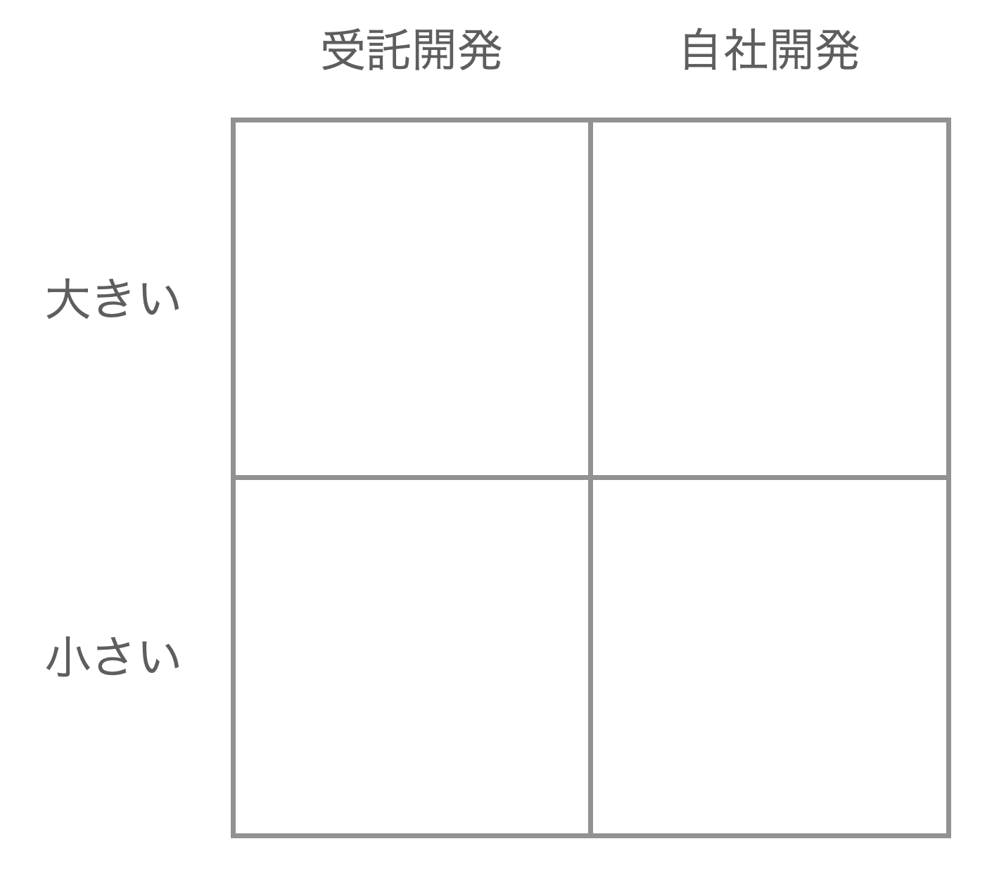

<!-- _class: lead -->

# Web系自社開発企業への就職

駒形真幸@株式会社ロッカ

<!--
Web系自社開発企業への就職ということでお話しさせていただきます。
株式会社ロッカの駒形と申します。
-->

---
<!-- _class: lead -->
## 自己紹介

## @komagata
株式会社ロッカの代表・プログラマー。
多くの会社を転々としてきて、現在はフィヨルドブートキャンプでメンターと
フィヨルドエージェントでエンジニアの方の企業への紹介をやっています。ruby大好き。

<!--
自己紹介をさせていただきたいと思います。
株式会社ロッカの代表兼プログラマーです。TwitterではkomagataというIDです。
いろんな会社を転々としてきて、現在はフィヨルドブートキャンプでメンターをやりつつ、
フィヨルドエージェントでエンジニアの方の企業への紹介をやっています。ruby大好きです。
-->

---
## Web系自社開発企業とは

今回は「主に自社でWebサービスを作っている企業」とさせていただきます。

⚠️ どちらが良い・悪いということではありません。

Web系自社開発企業への転職を考えている方に向けて「自社開発企業」と「受託開発企業」を対比してお話しします。

<!--
今回は話すWeb系自社開発企業なんですが、「主に自社でWebサービスを作ってる企業」とさせていただきます。
注意なんですが、自社開発と受託開発のどちらが良い・悪いという意味ではありません。
Web系自社開発企業への転職を考えている方に向けて「自社開発企業」と「受託開発企業」を対比してお話したいと思います。
-->

---
## 目次

1. フィヨルドブートキャンプの紹介
1. フィヨルドエージェントの紹介
1. 用語整理
1. 企業の選び方
1. 自社開発企業に入るには

<!--
目次です。
まず、宣伝になっちゃうんですけど、フィヨルドブートキャンプとフィヨルドエージェントについて紹介させていただいて、
用語整理、企業の選び方、自社開発企業に入るにはという順番でお話しさせていただきます。
-->

---
## フィヨルドブートキャンプの紹介

フィヨルドブートキャンプはオンラインのプログラミングスクールです。

### 特徴

- サブスク形式
- メンターがプロだけ
- ハードで実践的なカリキュラム（1000時間）
- OSS開発を学べる・推進

<!--
FBCの紹介をさせていただきます。

フィヨルドブートキャンプはオンラインのプログラミングスクールです。
WebのEラーニングツールを使って学習していく形です。

特徴としては、受講料は月毎のサブスク形式になっていて、大金を最初に一気に払うのではなくて、月毎なので、
試してみてプログラマー向いてないなとなったら１ヶ月だけで辞めることもできるようになっています。

また、メンター陣がプロのエンジニアだけなのも特徴です。
よくあるスクールでは卒業生がアルバイトでメンターをやっていることも多いんですが、
フィヨルドブートキャンプでは全員がプロで副業でメンターをやってくださっています。
有名書籍の著者やOSSコミュニティで有名な方が多数在籍しています。

カリキュラムが単純にハードだという点も特徴で、大体1000時間ぐらいかかる分量になっています。
そして、このEラーニングツール自体を僕らと一緒にスクラム形式でチーム開発するカリキュラムだったりと、
実践的な内容が多いもの特徴です。

また、ただプログラマーとしての就職を目標にしているのではなくて、
良いプログラマー、特にOSSプログラマーになろうというのを掲げておりました。
OSSへのコントリビュート方法のカリキュラムがあったり、
OSSコミュニティのイベントで発表できるように練習のための初めてのLT会というのを定期的にやっていたりします。
-->

---

<!--
こちらは去年のKaigi on Railsというイベントで全員生徒の方や卒業生の方やメンターの方です。
-->

---

<!--
そしてついに今年は、卒業生のima1zumiさんという方がRubyコミッターになられて、
大きなRuybyKaigiというイベントのキーノートスピーカーにも選ばれました。
OSSプログラマーになろうとか、OSS活動をしようということでスクールで活動してきたので
特に僕らのおかげではないんですが、とっても良い結果だと思います。
-->

---

## フィヨルドエージェントの紹介

プログラマー専門の人材紹介サービス。
フィヨルドブートキャンプの卒業生だけでなく、エンジニアの紹介をやっています。

### 特徴

- 現役のエンジニアが運営している。
- コーディングテストの練習ができる。

<!--
次はフィヨルドエージェントの紹介をさせていただきます。

フィヨルドエージェントはプログラマー専門の人材紹介サービスです。
FBCの卒業生を企業に紹介しています。
また、知られていないんですが、FBCの卒業生以外の紹介もやっているので
転職をご希望のエンジニアの方はぜひお使いいただければと思います。

特徴の一つは、

現役のエンジニアが運営していて、技術に理解のある、プログラマーが幸せになれる企業様にだけ紹介している点があります。

また、FBCとも連携してプロを相手にコーディングテストの練習ができるところも特徴です。
-->

---
## 結論😀

### 企業の選び方

フィヨルドエージェントを使えばOK

### 自社開発企業に入るには

フィヨルドブートキャンプを使えばOK
　　
　　
　　
　　
　　
　　
　　
・・・は言い過ぎですがオススメしておきます。

<!--
今日の話は「企業の選び方」と「自社開発企業にどうすれば入れるのか」という2点なんですが、
それぞれフィヨルドエージェントとフィヨルドブートキャンプを使えばOKというのが結論になります
・・・というとちょっと言い過ぎなんですが、激しくおすすめしておきます。
-->

---
## 用語整理

**自社開発企業**

= 事業会社 = Webサービス企業

自社の商売に必要なシステムを自社で開発する会社

**受託開発企業**

他社の商売のためのシステムを他社から依頼されて作る会社
（注：どちらが良い・悪いではないです）

**SES契約**

エンジニアの能力を時間で提供する契約

**請負契約**

成果物を提供する契約

<!--
今日の話なんですが、まずは用語の定義・整理をしておきたいと思います。

自社開発企業は「自社の商売に必要なシステムを自社で開発する会社」です。
「事業会社」や「Webサービス企業」ってのも同じと考えてください。

受託開発企業は「他社の商売のためのシステムを他社から依頼されて作る会社」です。
繰り返しになりますが、どちらが良い・悪いではないです。

契約形態についてですが、SES契約っていうのはSystem Engineering Serviceで、
エンジニアの能力を時間いくらで提供する契約です。

それに対して請負契約っていうのは成果物を提供する契約です。
どう違うかというと、請負契約は何時間かかったとしても成果物ができなければお金がもらえません。
逆に時間を全然かけなくても成果物さえできればいいって感じですね。

これも単に契約の違いなのでどちらが良い・悪いというのはありません。
-->

---
## SES企業はやめた方がいいですか？

ただの契約形態なので良い悪いはない。

ただ、時間売りを悪用するブラック会社が存在するのも事実。

SES関係なくその会社がブラックかホワイトか見極めよう。

<!--
FBCの生徒の方からも「SES企業はやめた方がいいんですか？」というような話をよく受けるので以前こういうブログを書いたんですが、
やっぱり契約形態の違いなだけなのでどちらが良い・悪いということではありません。

僕が知っている企業様の中にもSES契約を使っているホワイトな企業もありますし、請負契約のブラックな企業もあります。
というか、プロジェクト毎に使い分けてる会社が多いと思います。

ただ、SES契約は客先に行って時間を過ごしさえすれば時間で請求できるという点を悪用して経験のない人を大量に雇って
送り込んでお金を儲けるようなブラック会社が存在するというのも事実としてあります。

お客さん側も請負契約は成果物の定義をきっちりしなきゃいけないので、
「何となく人手が足りないので手伝って欲しい」みたいな依頼の仕方ができず、
SES契約を選びがちだったりもします。

これは契約とか関係なく、その会社がブラックか、ホワイトかとか、自分がスキルアップできるのかなどを
しっかり見極める必要があります。
-->

---
## 企業の選び方

参考になる対立軸

**ワークスタイル**
リモートワーク or オフィスワーク

**志向性**
技術志向 or プロダクト志向

**キャリア**
専門職志望 or 管理職志望

**企業文化のスタイル**
ワイワイ系 or 職人系

<!--
企業の選び方なんですが、フィヨルドエージェントではいくつかの対立軸でアンケートをさせていただいて、
それを参考にして決めてもらっていますし、マッチする会社を紹介しています。

もちろん、年収や所在地などはまず必須なんですが、それ以外にもこれらのどちらに自分が当てはまるか考えて、
企業を選ぶと良いと思います。

まずワークスタイルにていてはリモートとオフィスに二つがありますが、最近オフィスへの出社への回帰はよくみられると思います。
しかし、受託開発企業についてはリモートのままというところが多いです。
おそらく受託開発の場合はプロジェクト毎に働くので、同じプロジェクトでない人とは普段から関わりが少なかったり、
客先常駐とかでなければリモートでも変わらないのでリモートワークが多いんだと思います。

次に志向性なんですが、自分のモチベーションとして、技術を高めることに関心が高いのか、
自分が作るプロダクトをよくすることに関心があるのかという違いがあると思います。
どちらかだけというわけではないと思いますが、企業によってどちらを求めてるということがあるので知っておくと良いと思います。

そしてキャリアですね。
プログラマーだったらその専門性を伸ばしていくのか、管理の方に進むのかという違いがあります。
企業によってキャリアラダーを公開しているところがあったり、例えば専門職だったらそのキャリアを進めるための道筋が
その企業にあるのかというのは聞いておいた方が良いです。

そして「企業文化のスタイル」というのは僕らが勝手に作って聞いていることなんですが、
企業の雰囲気をワイワイ系と職人系と分けさせていただいています。
ワイワイ系はそのままで、オフィスがワイワイしてる、コミュニケーションが多い感じで、仕事外でのイベントがあったりな感じです。
職人系はプロフェッショナルというか、仕事は黙々と静かにきっちりやってプライベートと仕事が分かれている大人な会社の感じです。

これもどちらが良いとかではなく、その人にとって合う合わないの話で、仕事が続くかどうか、
会社が楽しいかどうかに意外とかなり影響してくるので重要です。

こういった対立軸のどちらなのかを自分で答えてみて、行きたい会社がどちらのタイプなのか調べるのは大事だと思います。
-->

---
## 先入観

### 受託開発は・・・

- 多種多様な業界・技術・案件に携わるため、スキルの幅が広がりやすい？
- 新規のプロジェクトを新しい技術ではじめられる？
- 顧客との距離が近い？

### 自社開発は・・・

- スキルの幅が狭く深くになる？
- 大規模サイトの運営ノウハウがつく？
- 顧客との距離が遠い？

<!--
受託開発や自社開発について世の中的に言われていることが結構あります。
例えば、
受託開発は
多種多様な業界・技術・案件に携わるため、スキルの幅が広がりやすいとか
新規のプロジェクトを新しい技術ではじめられるとか
顧客との距離が近いとか。
また、
自社開発の方は
スキルの幅が狭く深くになるとか
大規模サイトの運営ノウハウがつくとか
顧客との距離が遠いなどなどですね。
-->

---
## 解像度を上げる

これらはかなり先入観や偏見も入っている。

**大きい受託**
技術：既に動いてるプロジェクトに入るので選択できない。同じ技術を深める方向
顧客との距離：一部の人のみ

**小さい自社**
技術：比較的自由に決められる。
顧客との距離：何でもやるので近い

<!--
これらはかなり先入観や偏見も入っているのでもう少し解像度を上げると、
小さい受託開発と大きい受託開発、小さい自社開発と大きい自社開発という分け方をしてみると
当てはまらなかったりする点も多いです。

例えば受託開発の中でも大きい受託開発の会社の場合は、大きいプロジェクトに入って
長くやることも多いのでずっと同じ技術を深める方向だったり、
プロジェクトが大きいので顧客とやりとりするのは一部の上の方の人だけだったり。

自社開発の方も小さい自社開発はフットワークが軽いので新しい技術をどんどにれたり自由にやれることも多いですし、
少人数では開発だけじゃなくてユーザー対応でもなんでもやるって感じなので顧客との距離も近かったりします。
-->

---

## 解像度を上げる

受託だから・・・自社だから・・・と言えることは意外と少ない。

その会社自体をしっかり調べて見極める必要がある。

<!--
実際の会社さんをみてみると、受託だから、自社だからといってこうだと言えることは少ないです。
自分の少しの経験から判断してしまうのは危ないと思います。
入りたい会社一つ一つについてしっかり調べるのが大事です。
-->

---

<!-- _class: lead -->
## 自社開発企業に入るには

<!--
自社開発に入るにはどうすれば良いかという話をしていきます。
-->

---
<!-- _class: lead -->
## 良い仕事をしてきていれば採用される？

<!--
（ちょっと待つ）
これまで良い仕事をしてきていればアピールしなくても採用されるという考えは捨ててください。
-->

---
## アウトプットをする

アウトプットは自分のキャリアの営業・広告活動。

営業しないで売れるわけない。

会社での見せられない仕事とは別に誰でも見れるアウトプットを持つ必要がある。

- 技術ブログ
- OSS活動
- Webサービス開発
- イベント登壇

FBCでもOSS活動を激しく支援しています。

<!--
企業の人にアピールするアウトプットをする必要があります。
アウトプットはキャリアの営業活動とか広告活動に当たります。
営業なしで売れるわけないです。
会社の仕事は言えない・見せられない場合があるので誰にでも見せられるアウトプットを持つ必要があります。
例えば、
技術ブログだったり、OSS活動だったり、自分で作ったWebサービスだったり、技術イベントに登壇した経験やその資料だったりです。
-->

---
<!-- _class: lead -->
## すぐ用意できる？

<!--
（少し待つ）
そういうのを就職活動するからといってすぐ用意できるかというと・・・
-->

---
## できない

すぐには用意できない。バレる。

普段からやっておく。そういう生活の癖を持つ。

- 仕事で必要なライブラリを業務時間外の家で作り、会社で使う。
- 仕事中にOSSにバグを見つけたら報告する・PRを作る。
- 仕事中にぶつかった技術的課題を公開しても良い形にしてブログに書く。

<!--
すぐには用意できないわけですよね。
急いで用意してもバレますし、普段からアウトプットする生活にしておく必要があります。
例えば、
これは僕が以前受託開発の会社に所属していた時にもやっていたんですが、
仕事で必要になったライブラリを業務時間外の家で作ってOSSとして公開して、
会社ではダウンロードして使うとか、
OSSにバグを見つけたときは回避するのではなく、バグ報告をして、なおせそうだったら治すとか。
仕事中にぶつかった技術的な問題を見せても大丈夫な形にしてブログに書くとかですね。
こうやって普段からなるべく社内の人だけじゃなく、誰でもみれる形に仕事をしておくと
転職する時に蓄積されているものが出せる状態になっています。
-->

---
## 面接やコーディングテストの練習

地味だけど凄く効く。

- 面接の練習
  - 1, 2回練習するのとしない能登は大違い。
- 適性診断テストの練習（SPI, CAB, GAB）
  - 一冊本を読んでやっておく。初見でやるのとは全然違う。  
- コーディングテストの練習
  - 経験しておく。面接官の前でやるのは緊張して実力が出しづらい。

フィヨルドエージェントでもやってます。

<!--
あとは、これはスキルやアウトプットに比べたら地味な話なんですが、
面接やコーディングテストの練習についてです。
フィヨルドエージェントでも力を入れてやらせてもらっているんですが、
特に、フィヨルドブートキャンプを卒業された方を紹介するときに、
もう技術に関してはOKなんですよね。卒業まで行けた方はスキルはついていて、
紹介する方としてはそれに関しては全く心配していません。
面接でのコミュニケーションがうまくいくかというのはとっても心配なので、
こちらも実際に練習が必要です。
こちら軽視され気味ですが、１、２回面接練習するのとしないのとでは本当に大違いです。
録画して自分で見直したら違いがわかると思います。

適性診断テストも、受ける会社が実施してる場合は対策本を一冊買ってさらっとやっておくのは大事です。
初見だとそもそもテストのフォーマットの理解がな買ったら焦ったりで本来の力が出せません。
ホワイトボードコーディングなどのコードを書く形のテストも練習で経験しておいた方がいいです。
特に人に見られながら喋りながらやるというのは初めてではなかなかできないことです。
普段なら絶対解けるような問題ができなかったりするので絶対にやっておくのがおすすめです。
-->

---
## AI時代の就職

- どうなるか誰もわからない。
- エンジニア、企業、紹介する側、みんな模索中。
- 仕様通りにコーディングだけする人の需要は減りそう。
- 顧客の要望を仕様化する仕事は増えそう。
- 仕様化しつつ、AIを使って実装もする人という立場が増えそう。
- 短期的にはジュニアの採用控えが起きそう。
- ボトルネックが実装から仕様化に移りそう。
- システムができることが増えるのでエンジニアが世の中に与えるインパクトは増える。

### やっておくといいこと

- 実装の爆速化について行けるようにAIを使った開発を身につける。
- 顧客の要求を仕様化できるようになる。
- ビジネスを開発できるようになる。

<!--
そして、おまけ的な感じになっちゃうんですが、これから就職する人にとってAIのことを
話さないわけにはいかないのでプログラマー兼エンジニア紹介をやっている立場として見えていることを
話したいとおもいます。

まずどうなるのか誰もわからないので常に市場調査・情報収集は欠かさない必要がありますよね。
エンジニア自身、企業、紹介する側、みんな模索中です。

まずみなさんも感じていると思いますが、仕様を与えられて、実装だけするっていう人の需要は減りそうですよね。
基本的に、これまではシステムを使ったビジネスの需要は多くて、システムが足りない状態で、
実装がボトルネックになっていたのでみんな「エンジニアはいないか〜」ってなってる状態でした。
そこでAIでたくさん実装できるようになると、仕様（つまりIssue）が足りなくなると思います。
顧客の要求を仕様にするのはまだAIができないので人間がやる必要があります。
Issueを作る速度は変わらないのでIssue作りつつ、AIで実装もやっちゃう人の需要は増えそうです。

悪いことばかりではなくて、エンジニアの生産性が爆増するのでエンジニアのパワーの世の中に対するインパクトは増えそうです。
少人数でも世の中に大きく役立つことができそうです。

現在自社開発企業への就職を目指す人にとっては、やることはいくつかあって
AIを使いこなして爆速開発できるようになっておくというのは、みんなそうなるので遅れないようにってことですね。
あとは上でも書いたように顧客の要求を仕様化・Issue化する需要が増えるのでそれができるようになっておく。
あとはさらに上流の「何を作ったら儲かるのか？」というビジネスを開発できるようになると良いと思います。
-->

---
## まとめ

- 受託、自社それぞれのよく言われる点に惑わされずに、しっかり調査し、自分にマッチした会社を選ぼう。
- 普段からアウトプットすべし。
- 面接・コーディングテストの対策は効くので絶対やるべし。

<!--
まとめになります。
受託、自社それぞれのよく言われる点に惑わされずに、しっかり調査し、自分にマッチした会社を選ぼう。というのと、
普段からアウトプットすべし。というところと、
面接・コーディングテストの対策は効くので絶対やるべし。という感じになります。
-->

---
<!-- _class: lead -->
## ご清聴ありがとうございました。

<!--
以上です。
ご清聴ありがとうございました。
-->