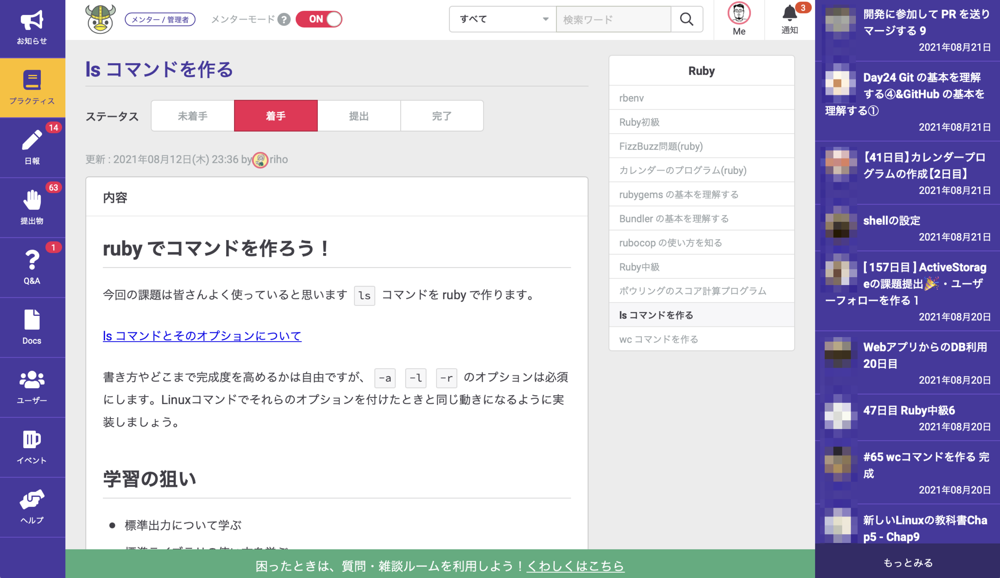
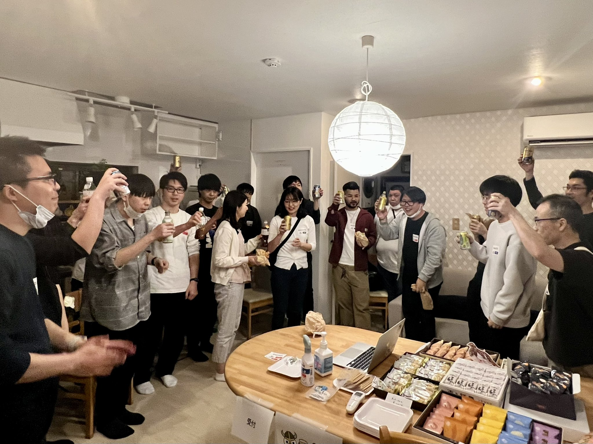
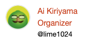
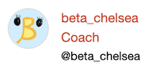

<!-- _class: lead -->

# FBCの紹介@RailsGirls Kagoshima 2nd

駒形真幸@株式会社フィヨルド

<!--
それでは「フィヨルドブートキャンプの紹介」というお話させていただきます。
株式会社フィヨルドの駒形と申します。
-->

---
<!-- _class: lead -->

## @komagata
フィヨルドブートキャンプ（FBC）代表・プログラマー・メンターです。

<!--
駒形と申します。
フィヨルドブートキャンプでは代表兼、プログラマー兼、スクールでのメンターをやっています。
-->

---

<!--
今日は僕らの運営しているプログラミングスクールのフィヨルドブートキャンプのご紹介をさせていただきます。
-->
 
---
## FBCとは
- Eラーニングツールをベースに学習できるオンラインのプログラミングスクールです。
- 特徴
  - ハードなカリキュラム
  - 本職のプログラマーのメンター
  - 活発な学習コミュニティが特徴です。

<!--
フィヨルドブートキャンプとは、
Eラーニングツールをベースに学習できるオンラインのプログラミングスクールです。
特徴は、
カリキュラムがハードであること
と
本職のプログラマーだけがメンターをしていること
と
- 活発な学習コミュニティが特徴です。
-->

---

<!--
こちらが実際のEラーニングツールのWebサイトの画面です。
このようにカリキュラムが並んでいて、上から順番にこなしていく感じになっています。
-->

---

<!--
それぞれ中身はこんな感じになっていて、
例えば「lsコマンドを作る」というカリキュラムでは、必要なドキュメントがあってそれを読んで学んでいく感じです。
-->

---

<!--
そしてプログラムを書いて提出する必要のあるカリキュラムもあって、
提出したら問題があればこんな感じでメンターとやり取りしながら修正していって、メンターからOKが出たら完了というようになっています。
-->

---
## 色々な質問方法

- 併設されているチャット（Discord）で聞ける。
- Q&A機能で聞ける。
- 日報にわからないことを書いて聞ける。
- 週3回のオンラインでの質問タイム。

<!--
フィヨルドブートキャンプでは気軽に質問できるように色々な質問方法を用意しています。

Discordのチャットが併設されているんですが、そこでいつでも聞けるようになっています。
また、先ほどのEラーニングツールのサイトにQ&A機能がついていてそこで質問を投稿することもできます。
そして、どういうことを学習したのか、日報を書く機能もあるんですが、メンターが全ての日報を確認しているので、そこで「ここがわからなかった」というような内容があれば必ず回答します。
他にも週に３回、月・水・金の16時〜17時にDiscordのビデオチャットにメンターが待機していて、そこにくれば音声で質問できますし、画面共有しながらわからないことろを教えてもらうこともできます。
-->

---

<!--
モザイクだらけでわかりづらいですが、これが併設されているDiscordのチャットです。
質問のためのチャンネルがあってそこで聞いたり、趣味のチャンネルで交流できたりします。
-->

---
## 色々な交流機能

- 日報で他の生徒と交流
- チャットで他の生徒やメンターと交流
- 月１回のオンラインミートアップで交流
- 生徒の方主催のさまざまな輪読会で交流
- オンラインランチ会で交流
- オンラインもくもく会（もくもくと作業する会）で交流
- オフラインのオープンソースイベントで交流

<!--
色々な交流のための機能や取り組みもあります。

EラーニングツールがSNSのようになっているので、先ほどお話した日報・コメント・Discordのチャットなどで他の生徒の方とやり取りすることができます。
また、月に一回、オンラインのミートアップを行なっていて、お酒を飲みながら話したり、卒業式をやったりしています。
他にも生徒の方主催の技術本の輪読会がたくさんあったり、ランチ会やオフラインでみんなで集まって作業する「もくもく会」なども行われています。
その他にもオープンソースコミュニティのイベントへの参加を推奨していて、僕らも含めてみんなで参加しています。
-->

---

<!--
これは2022年に三重県の津というところで行われたRubyKaigiでのフィヨルドブートキャンプの卒業生やメンターや生徒の集合写真です。
-->

---

<!--
今年の2023年のRubyKaigiは長野県の松本で行われたんですが、
今回からちょっとRubyKaigiに一人で行くには敷居が高いという生徒の方のために、
フィヨブーハウスという弊社がAirBで家を貸し切って、希望者に無料で宿泊してもらうという
取り組みを始めました。
この写真はその時のものです。
-->

---

<!--
RubyKaigi自体もこんな感じで集合写真を撮りまして、毎年集まってもらって撮っている感じです。
-->

---
### RailsGirlsからFBCを経てプログラマーになった方々

    

### コーチとして参加(FBCではメンター・アドバイザー)

   

<!--
このRailsGirlsからフィヨルドブートキャンプに入られてプログラマーになった方もたくさんいまして、
オーガナイザーをやったり、スタッフをやったりしています。
また、フィヨルドブートキャンプのメンターやアドバイザーの方々も頻繁にコーチとして参加していたりします。
-->

---

<!-- _class: lead -->
## 今日体験してプログラミングが面白いと思った方

<!--
今日体験してプログラミングが面白いと思った方
-->

---
<!-- _class: lead -->
## プログラマーに向いています！

<!--
プログラマーに向いています！
-->

---
<!-- _class: lead -->
## 今日やったことの中身を詳しく知りたい方

<!--
そして、今日やったことの中身を詳しく知りたい方
-->

---
<!-- _class: lead -->
## FBCで詳しく習えます！

<!--
フィヨルドブートキャンプで詳しく習えます！
-->

---
<!-- _class: lead -->
# プログラマーとして就職したい方はぜひ！

https://bootcamp.fjord.jp

<!--
プログラマーとして就職したい方はぜひ、検討してみてください。

以上で私の発表を終わりにしたいと思います。
ありがとうございました。
-->
