<!-- _class: lead -->

# FBCの紹介@RailsGirls

駒形真幸@株式会社フィヨルド

---
<!-- _class: lead -->

## @komagata
フィヨルドブートキャンプ（FBC）代表・プログラマー・メンターです。

---
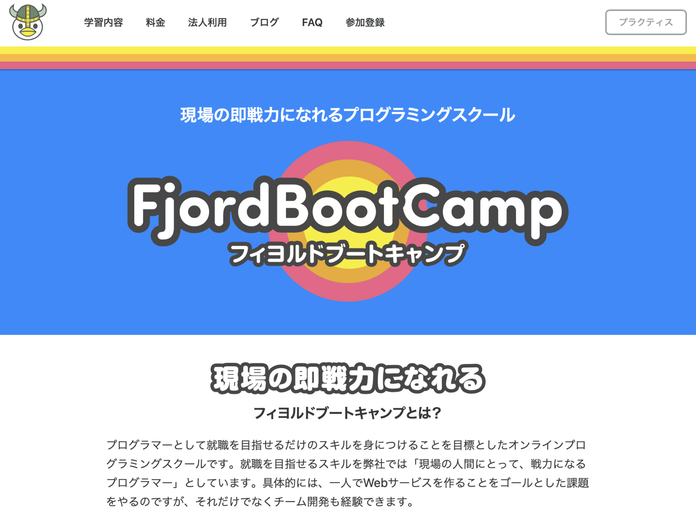

---
## FBCとは
- Eラーニングツールをベースに学習できるオンラインのプログラミングスクールです。
- 特徴
  - ハードなカリキュラム
  - 本職のプログラマーのメンター
  - 活発な学習コミュニティが特徴です。

---
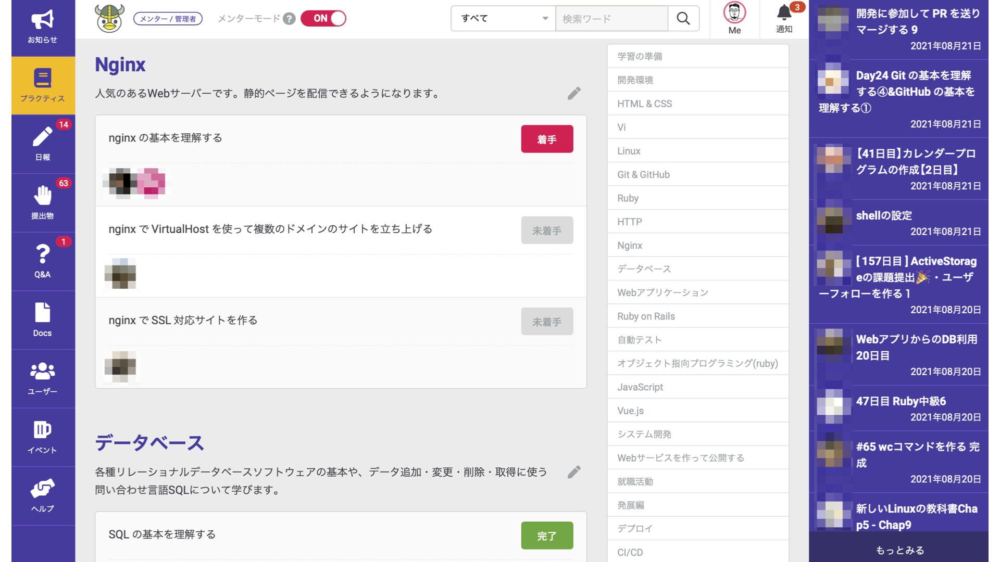

---
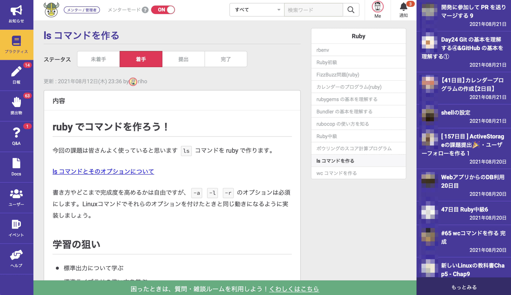

---
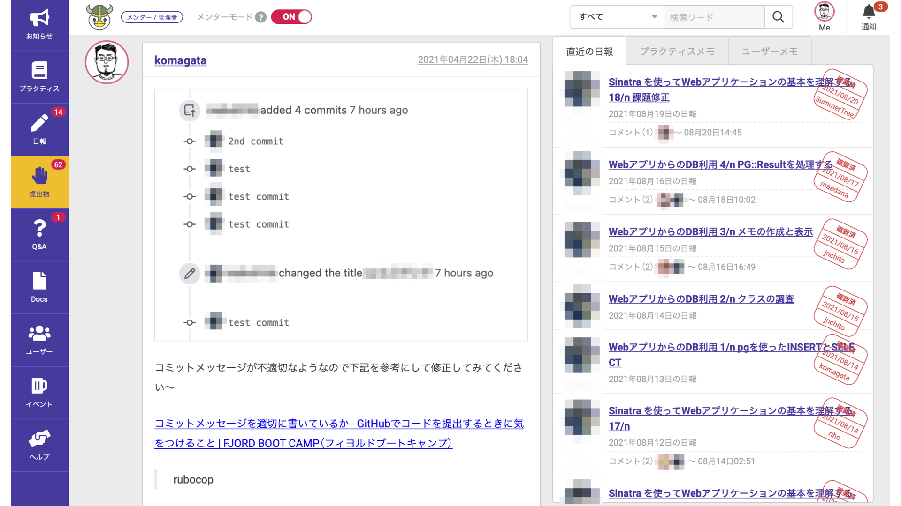

---
## 色々な質問方法

- 併設されているチャット（Discord）で聞ける。
- Q&A機能で聞ける。
- 日報にわからないことを書いて聞ける。
- 週3回のオンラインでの質問タイム。

---
## 色々な交流機能

- 日報で他の生徒と交流
- チャットで他の生徒やメンターと交流
- 月１回のオンラインミートアップで交流
- 生徒の方主催のさまざまな輪読会で交流
- オンラインランチ会で交流
- オンラインもくもく会（もくもくと作業する会）で交流
- オフラインのオープンソースイベントで交流

---
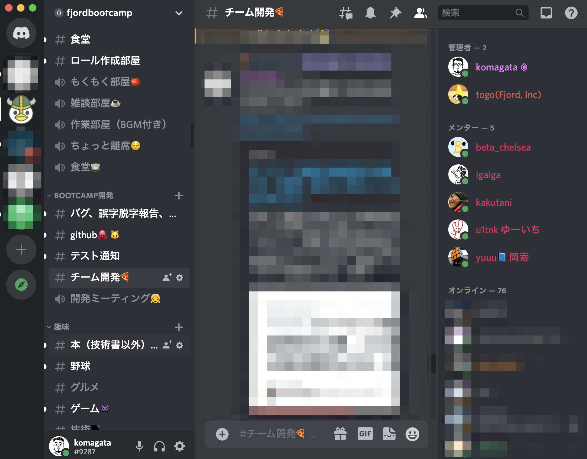

---
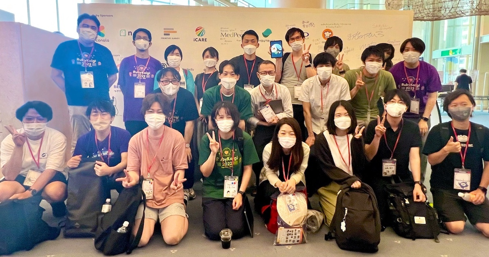

---
## RailsGirlsからFBCを経てプログラマーになった方々

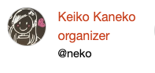 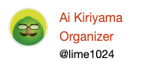 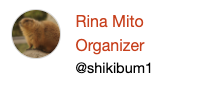 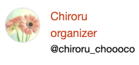 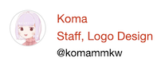

## コーチとして参加(FBCではメンター)

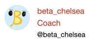 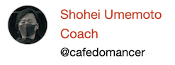

---

<!-- _class: lead -->
## 今日体験してプログラミングが面白いと思った方

---
<!-- _class: lead -->
## プログラマーに向いています！

---
<!-- _class: lead -->
# プログラマー就職したい方はぜひ！

https://bootcamp.fjord.jp
